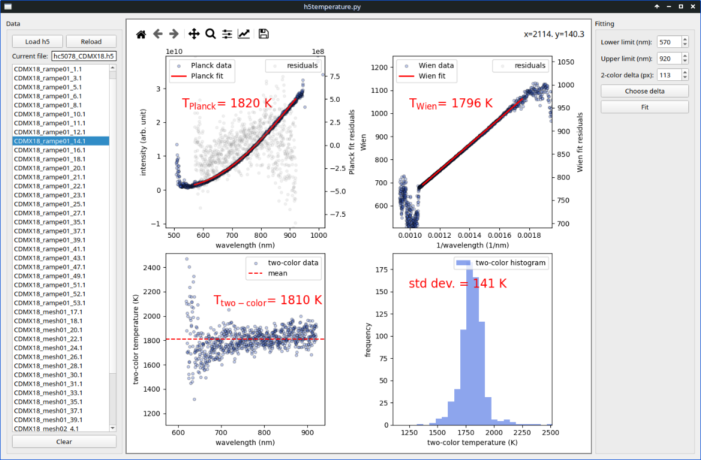

# h5temperature

## Description

h5temperature is a GUI application that allows for the analysis of radiometric temperature measurements within the diamond anvil cell from ESRF HDF5 data files. It allows users to fit data using Planck and Wien formulas, as well as conduct sliding two-color pyrometry analysis. For detailed information on methods, see [Laura Robin Benedetti & Paul Loubeyre (2004), Temperature gradients,
wavelength-dependent emissivity, and accuracy of high and very-high temperatures
measured in the laser-heated diamond cell, High Pressure Research, 24:4, 423-445](https://doi.org/10.1080/08957950412331331718). 


## Requirements 

Python3 packages:

* h5py
* numpy
* matplotlib
* scipy
* pyqt5
* python-dateutil

## Running the Program

### From source 

Check you have the requirements above installed for your python3 distribution. Then run 
```
python3 h5temperature.py
```
or run it through any python interpreter.

To install all required dependencies, run in the source directory:
```
pip install -r requirements.txt
```

### Executable for Windows 

Download the latest Release package for Windows, unpack it, and run h5temperature.exe.

In case of errors occurring at launch, particularly regarding module imports, it may be necessary to install Microsoft Visual C++ Redistributable. You can find it here:

[https://learn.microsoft.com/fr-fr/cpp/windows/latest-supported-vc-redist?view=msvc-170](https://learn.microsoft.com/fr-fr/cpp/windows/latest-supported-vc-redist?view=msvc-170).

Tested on Windows 10 only.

## Use 

Use the "Load h5" button to load a specific HDF5 file. **Currently, you must open the .h5 file corresponding to a *newsample('Samplename')* created from BLISS, typically named *Proposalname_Samplename.h5*.** 
All temperature measurements within this file will be displayed.

A first fitting is performed automatically upon clicking. If you make changes to the parameters, click "Fit" to apply them. 

Currently, exporting data is not supported.

## Example




## Future improvements

* Export the results of the fits.
* Unique set of parameters for each temperature data.
* Capability to save and load sessions.
* Recursively locate temperature data from any HDF5 file in the arborescence?