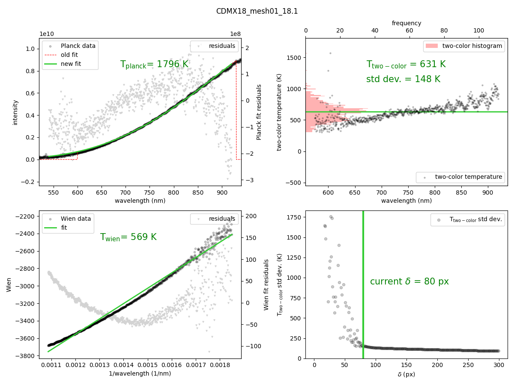

Program for analyzing radiometric temperature measurements in the diamond anvil cell at ESRF-ID27.
Reads h5 files.
May be improved with a GUI in the future...

see [Laura Robin Benedetti & Paul Loubeyre (2004) Temperature gradients,
wavelength-dependent emissivity, and accuracy of high and very-high temperatures
measured in the laser-heated diamond cell, High Pressure Research, 24:4, 423-445](https://doi.org/10.1080/08957950412331331718)

Example:
